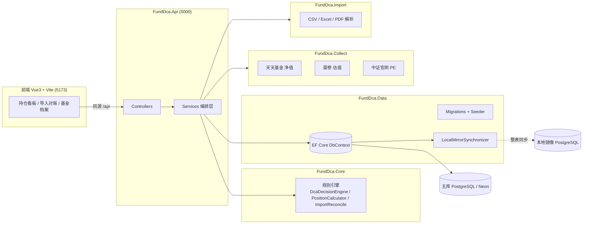
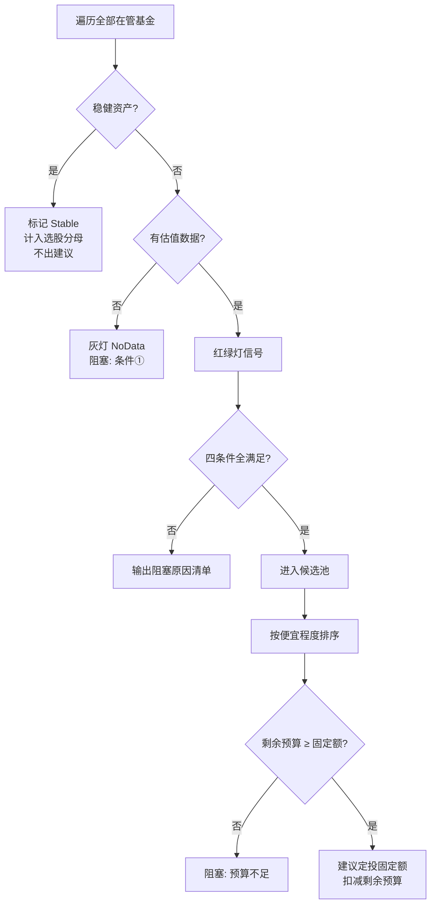
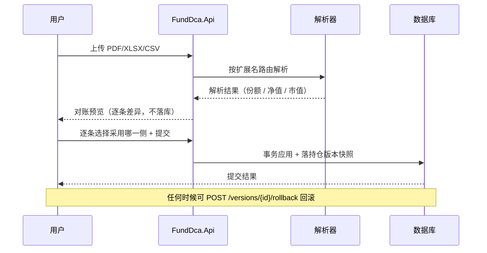
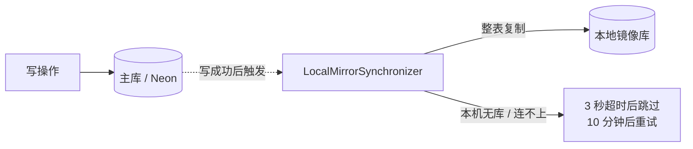

# fund-dca-system 基金持仓看板与定投决策系统

一个面向个人投资者的**基金持仓看板 + 定投决策 + 资产证明对账**系统。

它把「资产证明里的持仓数据」「指数估值」「基金净值」自动汇总成一个统一看板，再按一套**可解释、可复现的规则**给出每周定投建议——买哪只、买多少、为什么买、为什么不买，全部写清楚，不掺杂主观判断。

> 核心设计原则：**规则是纯函数**。所有判定逻辑集中在 `FundDca.Core`，不依赖数据库、不依赖网络、不依赖时间，输入相同则输出必然相同，因此可以被完整单元测试覆盖，也可以随时被复核。

---

## 目录

- [功能特性](#功能特性)
- [技术栈](#技术栈)
- [系统架构](#系统架构)
- [核心业务规则](#核心业务规则)
- [项目结构](#项目结构)
- [快速开始](#快速开始)
- [配置说明](#配置说明)
- [API 接口清单](#api-接口清单)
- [数据来源](#数据来源)
- [资产证明导入与对账](#资产证明导入与对账)
- [云端部署与本地镜像](#云端部署与本地镜像)
- [测试](#测试)
- [常见问题](#常见问题)
- [安全与版本控制](#安全与版本控制)

---

## 功能特性

| 模块 | 说明 |
|------|------|
| **持仓看板** | 盘后按「份额 × 单位净值」汇总全部持仓市值，展示分母 D、今日盈亏、累计收益率、单只占比、赛道聚合占比 |
| **盘中估算** | 盘中用「跟踪指数实时涨跌幅 × 最新确认净值」估算净值/市值/今日盈亏，不落库，前端 60 秒轮询 |
| **定投决策** | 按四条件（低估 / 亏损 / 单只占比 / 赛道占比）自动判定每只基金本周是否定投，给出固定额建议与逐条阻塞原因 |
| **红绿灯信号** | 按跟踪指数的估值百分位（或盈利收益率绝对值）给出绿 / 黄 / 红 / 灰信号 |
| **买入登记** | 登记即预入账（先占预算与本金），T 日收盘净值到位后自动按 T 日净值校正份额并转「已确认」 |
| **待确认管理** | 待确认买入列表、一键撤销（反恢预入账）、净值刷新后自动确认 |
| **资产证明导入** | 上传 PDF / Excel / CSV 资产证明，本地解析后与当前持仓逐条对账，用户逐条选择「采用哪一侧」再事务落库 |
| **版本快照与回滚** | 每次导入落一个持仓版本，支持一键回滚到任意历史版本 |
| **估值采集** | 蛋卷全量估值 → 未覆盖指数回落代理指数 → 仍无数据时用中证官网自有 PE 历史现算百分位 |
| **净值采集** | 天天基金（东方财富）历史净值接口，单只基金静默重试 5 次，单只失败不阻断其他 |
| **手工市值** | 货币基金 / 多产品合并的虚拟标的（如「7日理财+」）手工维护市值，不采集净值、不模拟收益 |
| **赛道去重** | 持仓重叠的基金（如两只都买沪深300）配置重叠组，由主基金代表出建议，避免重复补仓 |
| **本地镜像** | 主库（云）为唯一事实来源，每次写操作后整表复制到本机 PostgreSQL，本地没装库则自动跳过 |

---

## 技术栈

**后端**

- .NET 10 / ASP.NET Core Web API（`net10.0`）
- Entity Framework Core 10 + Npgsql（PostgreSQL）
- ClosedXML（Excel 解析与模板生成）
- PdfPig（PDF 文本抽取）
- 枚举以字符串序列化（前端无需维护魔法数字）

**前端**

- Vue 3 + TypeScript
- Vite 8（开发期代理 `/api`、`/health` 到后端 5000 端口）
- ECharts 6（图表）

**数据库**

- PostgreSQL（云端 Neon / 本地 PostgreSQL 皆可）
- 可选本地镜像库，用于离线查看与冗余备份

**测试**

- xUnit（覆盖规则引擎与对账逻辑）

---

## 系统架构



**分层职责**

| 项目 | 职责 | 依赖 |
|------|------|------|
| `FundDca.Core` | 领域模型、枚举、**纯函数规则引擎** | 无 |
| `FundDca.Data` | EF Core `DbContext`、迁移、种子数据、镜像同步 | Core |
| `FundDca.Collect` | 净值 / 估值 / 行情采集与编排 | Core, Data |
| `FundDca.Import` | 资产证明解析（CSV / Excel / PDF） | Core, Data |
| `FundDca.Api` | Web API 宿主、Controllers、Services 聚合编排 | 全部 |

> 依赖方向单向向下：`Core` 是最内层，不知道数据库和网络的存在。这条边界保证了规则可测试、可移植。

---

## 核心业务规则

### 持仓占比分母 D

**分母 D = 全部在管基金当前市值之和**（股票型 / 混合型 / QDII / 债券型 / 货币型全部计入）。

银行卡上待投的当月预算**不计入 D**。货币基金市值取手工维护值。

### 定投四条件（必须同时满足）

对每只**权益类**基金（股票 / 混合 / QDII，QDII 视流动性与净值口径另计），本周同时满足以下 4 条才定投**固定额**（默认 50 元），任一不满足即不操作：

| # | 条件 | 口径 |
|---|------|------|
| ① | **跟踪指数处于低估区间** | PE/PB 口径：历史百分位 **<** 低估阈值（默认 30）<br/>盈利收益率口径：E/P 绝对值 **≥** 低估线（默认 10%） |
| ② | **该基金总收益率为负** | 当前市值 **<** 累计投入本金 |
| ③ | **单只当前占比 < 10%** | 严格小于，等于 10% 不通过 |
| ④ | **所属赛道总占比 < 15%** | 严格小于，等于 15% 不通过 |

**附加闸门**

- **投后红线校验**：当前占比虽低于红线，但加上固定额后会越线时同样不通过（边界安全校验）
- **去重组**：同组内非主基金不出建议
- **预算闸门**：全部建议合计不得超过当月剩余预算；候选基金按「越便宜越优先」排序依次分配固定额
- **稳健资产**：债券 / 货币只计入 D，不参与定投判定（标记为 `Stable`）

### 估值红绿灯

| 信号 | PE/PB 口径（百分位，越低越便宜） | 盈利收益率口径（E/P，越高越便宜） |
|------|--------------------------------|--------------------------------|
| 🟢 Green | 百分位 **<** 低估阈值 | E/P **≥** 低估线 |
| 🟡 Yellow | 低估阈值 ≤ 百分位 < 高估阈值 | 高估线 < E/P < 低估线 |
| 🔴 Red | 百分位 **≥** 高估阈值 | E/P **≤** 高估线 |
| ⚪ NoData | 无估值数据 / 无跟踪指数 | 同左 |
| ⬜ Stable | 稳健资产（债券 / 货币） | — |



### 估值口径

| 口径 | 适用 | 默认阈值 |
|------|------|---------|
| `PeTtm` | 宽基、成长、消费类 | 低估 30 / 高估 70（历史百分位） |
| `Pb` | 红利、金融周期、盈利不稳定类 | 低估 30 / 高估 70（历史百分位） |
| `EarningsYield` | 需要按绝对值判定的指数（如红利低波） | 低估 10% / 高估 6.4%（E/P 绝对值） |
| `None` | REITs / FOF 等 | 不参与自动判定 |

**代理估值**：数据源未覆盖本指数时，可用高相关指数的百分位代为判定（如 中证A50 → 沪深300、中证消费50 → 中证主要消费），前端会明示「代理估值」。

---

## 项目结构

```
fund-dca-system/
├── README.md
├── .gitignore                 # 排除构建产物与所有含密码的 appsettings.json
├── .gitattributes             # 统一换行符（C# CRLF / 前端 LF）
└── fund-dca-app/
    ├── FundDca.slnx           # 解决方案
    ├── src/
    │   ├── FundDca.Core/      # 领域模型 + 规则引擎（纯函数，无外部依赖）
    │   │   ├── Domain/        # Fund / Holding / Trade / IndexInfo / IndexValuation …
    │   │   └── Rules/         # DcaDecisionEngine / PositionCalculator / TradeMath / ImportReconcile
    │   ├── FundDca.Data/      # DbContext / Migrations / DbSeeder / 镜像同步
    │   ├── FundDca.Collect/   # 净值、估值、行情采集
    │   ├── FundDca.Import/    # 资产证明解析（CSV / Excel / PDF）
    │   └── FundDca.Api/       # Web API 宿主
    │       ├── Controllers/   # Dashboard / Funds / Decisions / Trades / Import / Collect
    │       ├── Services/      # Dashboard / Intraday / Decision / Trade / Import
    │       ├── Models/        # DTO
    │       ├── appsettings.example.json   # 配置模板（复制为 appsettings.json 使用）
    │       └── Properties/launchSettings.json
    ├── tests/
    │   └── FundDca.Core.Tests/  # xUnit 单元测试
    └── web/                     # Vue3 前端
        ├── src/
        │   ├── App.vue          # 顶部导航 + 后端连接状态
        │   ├── views/           # DashboardView / ImportView / FundArchiveView
        │   ├── api.ts           # 所有后端调用集中在此
        │   └── types.ts
        └── vite.config.ts       # 开发期代理 /api、/health → localhost:5000
```

---

## 快速开始

### 环境要求

| 组件 | 版本 | 说明 |
|------|------|------|
| .NET SDK | **10.0+** | 后端 |
| Node.js | **22+** | 前端 |
| PostgreSQL | 14+ | 主库必需；本地镜像可选 |
| Git | 任意 | 版本控制 |

### 1. 获取代码

```bash
git clone https://github.com/ALinXuexiao/fund-dca-system.git
cd fund-dca-system
```

### 2. 配置数据库连接

后端配置**不入库**（`appsettings.json` 已被 `.gitignore` 排除）。从模板复制一份：

```bash
cd fund-dca-app/src/FundDca.Api
cp appsettings.example.json appsettings.json
```

然后编辑 `appsettings.json`，填入真实连接串：

```json
{
  "ConnectionStrings": {
    "FundDca": "Host=<你的库地址>;Port=5432;Database=fund_dca;Username=<用户>;Password=<密码>;SSL Mode=Require",
    "FundDcaMirror": "Host=localhost;Port=5433;Database=fund_dca;Username=postgres;Password=<本地密码>"
  },
  "Mirror": { "Enabled": true }
}
```

> 也可以完全不写配置文件，改用环境变量覆盖：`ConnectionStrings__FundDca="..."`（层级用双下划线分隔）。

### 3. 启动后端

```bash
cd fund-dca-app
dotnet run --project src/FundDca.Api
```

- 默认监听 `http://localhost:5000`
- **启动时自动执行 EF 迁移并写入种子数据**（首次运行会建表 + 灌入演示持仓）
- 开发环境下 OpenAPI 文档映射在 `/openapi`，健康检查在 `/health`

### 4. 启动前端

```bash
cd fund-dca-app/web
npm install
npm run dev
```

浏览器打开 `http://localhost:5173`，页面右上角显示「后端已连接」即成功。

### 5. 构建前端产物

```bash
cd fund-dca-app/web
npm run build     # 产物输出到 dist/
```

前端只与同源 `/api` 通信，部署时把 `dist/` 放到任意静态服务器，并将 `/api`、`/health` 反向代理到后端即可，**业务代码无需修改**。

---

## 配置说明

`appsettings.json` 完整字段：

```json
{
  "Logging": {
    "LogLevel": {
      "Default": "Information",
      "Microsoft.AspNetCore": "Warning",
      "Microsoft.EntityFrameworkCore": "Warning"
    }
  },
  "AllowedHosts": "*",
  "ConnectionStrings": {
    "FundDca": "主库连接串（必需）",
    "FundDcaMirror": "本地镜像连接串（可选）"
  },
  "Mirror": {
    "Enabled": true
  },
  "Collector": {
    "RetryDelaysSeconds": [ 1, 2, 4, 8, 10 ],
    "TimeoutSeconds": 12
  }
}
```

| 配置项 | 说明 |
|--------|------|
| `ConnectionStrings:FundDca` | 主库连接串，**必需**，缺失则启动直接报错。云端数据库需带 `SSL Mode=Require` |
| `ConnectionStrings:FundDcaMirror` | 本地镜像库连接串，可选。留空或与主库相同则自动禁用镜像 |
| `Mirror:Enabled` | 是否启用本地镜像同步，默认 `true` |
| `Collector:RetryDelaysSeconds` | 单只基金采集失败的静默重试间隔（秒），数组长度即重试次数 |
| `Collector:TimeoutSeconds` | 采集 HTTP 请求超时（秒） |

> **Neon 连接串提示**：单用户低流量场景使用**直连地址**（去掉主机名中的 `-pooler`），避免连接池带来的额外问题。

---

## API 接口清单

所有接口均以 `/api` 为前缀，枚举值以字符串返回。

### 系统

| 方法 | 路径 | 说明 |
|------|------|------|
| GET | `/health` | 健康检查，返回服务状态与当前时间 |

### 看板

| 方法 | 路径 | 说明 |
|------|------|------|
| GET | `/api/dashboard` | 盘后看板：分母 D、今日盈亏、权益累计收益、逐行持仓占比与赛道聚合 |
| GET | `/api/dashboard/intraday` | 盘中估算：跟踪指数实时涨跌幅 × 最新确认净值，不落库（后端缓存 30 秒） |

### 基金档案

| 方法 | 路径 | 说明 |
|------|------|------|
| GET | `/api/funds` | 全部基金档案（按赛道排序） |
| GET | `/api/funds/{code}` | 单只基金档案 |
| PUT | `/api/funds/{code}/manual-value` | 手工维护市值（仅货币基金 / 手工市值标的） |

### 定投决策与设置

| 方法 | 路径 | 说明 |
|------|------|------|
| GET | `/api/decisions/today` | 今日定投决策：红绿灯、四条件判定、固定额建议 |
| GET | `/api/decisions/settings` | 读取单次定投固定金额 |
| PUT | `/api/decisions/settings` | 更新单次定投固定金额（0 ~ 100000 元） |
| PUT | `/api/decisions/budget` | 更新当月预算（预算额 / 已投额），决策立即按新剩余预算重算 |

### 买入流水

| 方法 | 路径 | 说明 |
|------|------|------|
| POST | `/api/trades` | 登记一笔买入（登记即预入账，T 日净值到位后自动校正） |
| GET | `/api/trades/pending` | 待确认买入列表 |
| POST | `/api/trades/confirm-pending` | 手动触发待确认买入按 T 日净值校正入账 |
| POST | `/api/trades/{id}/cancel` | 撤销一笔待确认买入（反恢预入账，置 `Cancelled`） |

### 资产证明导入

| 方法 | 路径 | 说明 |
|------|------|------|
| POST | `/api/import/parse-demo` | 用内置演示资产证明解析并对账（不走文件上传） |
| POST | `/api/import/parse` | 上传资产证明（PDF / XLSX / CSV），本地解析返回对账预览（**不落库**） |
| POST | `/api/import/commit` | 确认导入：按逐条差异选择，事务应用并落持仓版本快照 |
| GET | `/api/import/versions` | 持仓版本列表（回滚入口） |
| POST | `/api/import/versions/{id}/rollback` | 一键回滚到指定持仓版本 |
| GET | `/api/import/template` | 下载标准 Excel 导入模板（PDF 版式无法识别时的兜底） |

### 数据采集

| 方法 | 路径 | 说明 |
|------|------|------|
| POST | `/api/collect/refresh` | 立即拉取全部启用基金最新净值，并自动确认待确认买入 |
| POST | `/api/collect/refresh-valuations` | 立即拉取全部跟踪指数最新估值（含代理回落与中证兜底） |

---

## 数据来源

| 数据 | 来源 | 接口 | 备注 |
|------|------|------|------|
| 基金净值 | 天天基金（东方财富） | `api.fund.eastmoney.com/f10/lsjz` | 需带 `Referer: https://fundf10.eastmoney.com/`，否则 403；QDII 最新日期自然晚一天 |
| 指数估值 | 蛋卷基金 | `danjuanfunds.com/djapi/index_eva/dj` | 一次返回全部指数（60+），无需鉴权；百分位由 0-1 小数统一 ×100 |
| 指数自有 PE | 中证指数官网 | `csindex.com.cn/.../indexCsiDsPe` | 蛋卷未覆盖的中证系列指数兜底，按配置窗口现算百分位 |
| 指数实时行情 | 东方财富 | 指数行情接口 | 盘中估算用，后端缓存 30 秒 |

**兜底链路**：蛋卷全量 → 代理指数 → 中证官网自有 PE 历史 → 标记为「数据源未覆盖」（可在档案中配置代理指数）。

数据源地址集中在 `FundDca.Collect` 的各 Source 类中，若接口变更只需改动对应类。

---

## 资产证明导入与对账

导入流程分成三步，**解析与落库完全分离**：



- **解析器路由**：按文件扩展名分发到 `CsvStatementParser` / `ExcelStatementParser` / `PdfStatementParser`
- **对账**：解析结果与当前持仓逐条比对，标出「仅证明有 / 仅系统有 / 数值不一致」
- **版本快照**：每次提交落一个持仓版本（`PositionVersion` + `PositionVersionItem`），可一键回滚
- **兜底模板**：PDF 版式无法识别时，下载标准 Excel 模板手工填写后再导入

---

## 云端部署与本地镜像

### 主库 + 镜像架构

**主库（云端）是唯一事实来源**，本地 PostgreSQL 仅作镜像：



- **触发方式**：`MirrorSyncSaveChangesInterceptor` 挂在 EF Core 的 `SaveChanges` 上，每次写操作成功后后台异步触发一次同步
- **同步策略**：整表复制（个人持仓数据量小，整表同步最简单可靠，天然自愈）
- **失败处理**：本机未装 PostgreSQL / 库不存在 / 连接失败时，3 秒内快速失败并跳过，**绝不影响主流程**；失败后 10 分钟内不再重试
- **自动禁用**：主库与镜像连接指纹（主机:端口:库:用户）相同时自动禁用镜像（尚未上云的开发机）

### 跨设备查看持仓

把主库指向云端 PostgreSQL（如 Neon），在任何设备上克隆代码、填好连接串即可查看同一份持仓数据。

---

## 测试

规则引擎是纯函数，因此测试无需数据库、无需网络：

```bash
cd fund-dca-app
dotnet test
```

| 测试文件 | 覆盖 |
|----------|------|
| `DcaDecisionEngineTests.cs` | 定投四条件、红绿灯、预算闸门、去重、投后红线校验 |
| `PositionCalculatorTests.cs` | 分母 D、单只/赛道占比、稳健资产识别 |
| `TradeMathTests.cs` | 买入份额预占与 T 日校正 |
| `ImportReconcilerTests.cs` | 资产证明对账差异判定 |

---

## 常见问题

**Q：启动报 `缺少连接串 ConnectionStrings:FundDca`**
A：没有 `appsettings.json`。从 `appsettings.example.json` 复制一份并填入连接串，或用环境变量 `ConnectionStrings__FundDca` 提供。

**Q：启动日志出现「启动镜像同步失败」告警**
A：属正常现象。本机未安装 PostgreSQL 或镜像库不存在时会打印该告警，**主库不受任何影响**。不需要镜像可把 `Mirror:Enabled` 设为 `false`。

**Q：刷新净值时部分基金失败**
A：单只基金内部会静默重试 5 次（间隔可在 `Collector:RetryDelaysSeconds` 配置）；仍失败的基金进入 `failures` 由前端弹窗提示，**不阻断其他基金**。

**Q：某指数提示「数据源未覆盖该指数」**
A：该指数不在蛋卷覆盖范围内。可在基金档案里为它配置「代理指数」，或改用 `PeTtm` 口径走中证官网自有 PE 兜底。

**Q：前端页面显示「后端未连接」**
A：确认后端已在 `http://localhost:5000` 启动，且 `vite.config.ts` 里的代理目标端口一致。

**Q：QDII 基金净值日期比国内基金晚一天**
A：正常现象。QDII 净值确认通常为 T+1 / T+2，属于产品特性。

---

## 安全与版本控制

- **敏感配置不入库**：`.gitignore` 排除了所有 `appsettings.json` / `appsettings.*.json`（仅保留 `appsettings.example.json` 模板）。密码永远只存在于本机
- **前端不直连数据库**：所有数据访问经后端 API，前端只与同源 `/api` 通信
- **换行符统一**：`.gitattributes` 规定 C# 用 CRLF、前端用 LF，避免跨平台混乱

### 日常操作

```bash
# 提交推送
git add .
git commit -m "说明"
git push

# 回滚到 GitHub 最新版本（密码配置不受影响）
git fetch origin
git reset --hard origin/main

# 查看提交历史
git log --oneline
```

> 回滚**不会**覆盖本机 `appsettings.json` —— 该文件从未被 Git 跟踪过。

---

## 开发里程碑

各阶段的数据库迁移完整保留了演进过程：

| 阶段 | 迁移 | 内容 |
|------|------|------|
| M0 | `InitialCreate` | 基础档案、赛道、指数、定投设置 |
| M1 | `M1_PortfolioNavSnapshot` | 持仓、净值、日快照、预算月 |
| M2 | `M2_ValuationDecision` | 指数估值、定投决策 |
| M3 | `M3_Buy_Trades` / `M3_Trade_Cancel_StatusLength` / `M3_Import_PendingFix` | 买入流水、撤销、资产证明导入对账与版本回滚 |
| M4 | `M4_EarningsYieldMetric` | 盈利收益率（E/P）估值口径 |
| M5 | `M5_Proxy` | 估值代理指数 |
| M6 | `M6_FixTrackedIndex` | 跟踪指数修正 |
| M7 | `M7_ValuationProxy` | 估值代理与中证兜底 |
| M8 | `M8_CsiOwnPe` | 中证官网自有 PE 历史 |